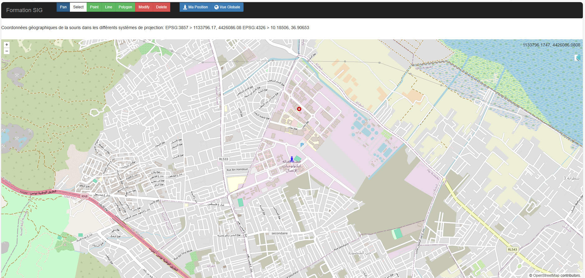

# WebMapping Project

## Description

This project is a WebMapping application developed with HTML, JavaScript, OpenLayers, and Bootstrap. It allows users to interact with maps by drawing geometries, dynamically updates and centers the map on the user's geographical position, and enhances the interface with a responsive Bootstrap theme. Additionally, Elasticsearch and Postman are utilized for managing geospatial data.

## Features

- **Drawing on the Map:** Users can interact with the map by drawing various geometries (e.g., points, lines) using the OpenLayers library.

- **Geolocation:** The application dynamically updates and centers the map on the user's geographical position, displaying an icon at the location.

- **Bootstrap Theme:** The interface is improved by incorporating a responsive Bootstrap theme from [BootstrapZero](http://www.bootstrapzero.com).

- **Elasticsearch Integration:** Geospatial data is managed using Elasticsearch. Postman is employed to interact with Elasticsearch for data querying and manipulation.

## Installation

1. Clone the repository.

2. Open the `osm_gs.html` file in a web browser.

## Figures

*Web Interface*

*Web Interface*

### Postman Interaction

*Postman*

### GeoServer Layers Creation

*Geoserver layers*

## Contributors

- Jawhar Marzougui
- Chayma Hamdi
